# Icons for WMO code

[WMO-CODE](https://www.nodc.noaa.gov/archive/arc0021/0002199/1.1/data/0-data/HTML/WMO-CODE/WMO4677.HTM)

| WMO code | Icon | Description |
|------------|-----|------------|
| 00 | 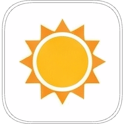 | Cloud development not observed (Clear) |
| 01 | 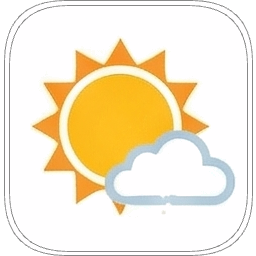 | Clouds dissolving or becoming less developed |
| 02 | 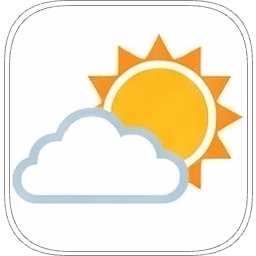 | State of sky on the whole unchanged |
| 03 | 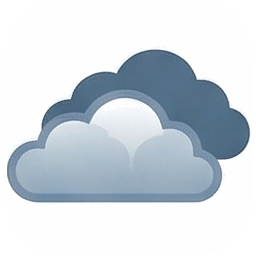 | Clouds forming or developing |
| 04 |  | Visibility reduced by smoke (Forest fires, industrial, etc.) |
| 05 | 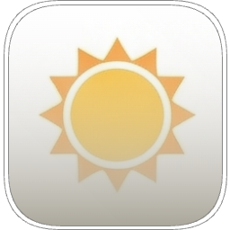 | Haze |
| 06 | 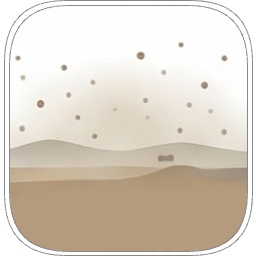 | Widespread dust in suspension in the air |
| 07 |  | Dust or sand raised by wind |
| 08 | 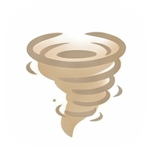 | Well developed dust/sand whirls |
| 09 | 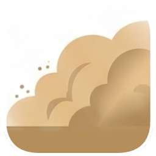 | Duststorm or sandstorm within sight |
| 10 | 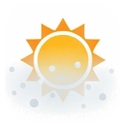 | Mist |
| 11 | 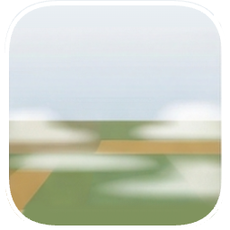 | Patches of shallow fog or ice fog |
| 12 | 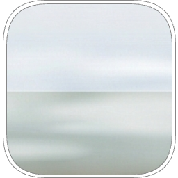 | Continuous shallow fog or ice fog |
| 13 |  | Lightning visible, no thunder heard |
| 14 | 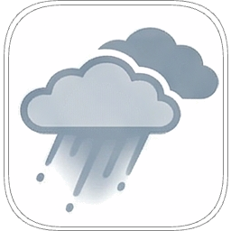 | Precipitation within sight, not reaching the ground (Virga) |
| 15 | 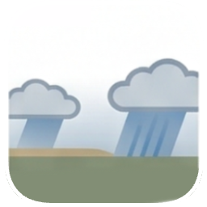 | Precipitation within sight, distant but reaching the ground |
| 16 | 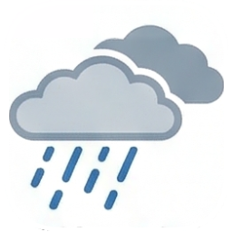 | Precipitation within sight, near but not at the station |
| 17 | 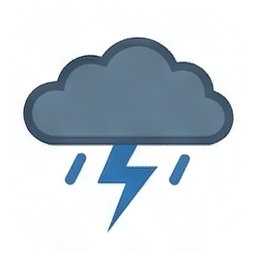 | Thunderstorm, but no precipitation at the station |
| 18 |  | Squalls |
| 19 | 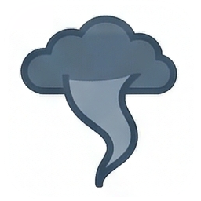 | Funnel cloud(s) (Tornado or water-spout) |
| 20 | 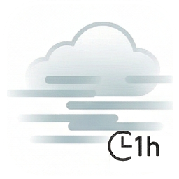 | Drizzle (not freezing) or snow grains during the past hour |
| 21 | 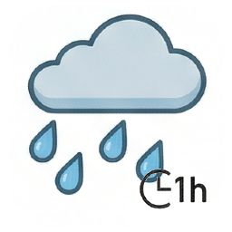 | Rain (not freezing) during the past hour |
| 22 | 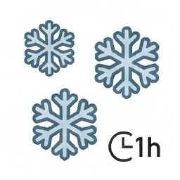 | Snow during the past hour |
| 23 | 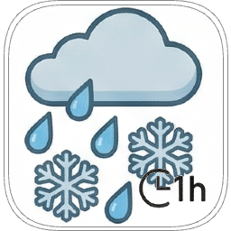 | Rain and snow or ice pellets during the past hour |
| 24 | 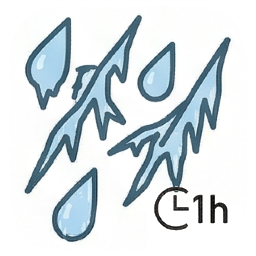 | Freezing drizzle or freezing rain during the past hour |
| 25 | 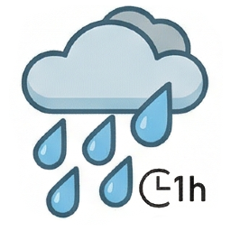 | Shower(s) of rain during the past hour |
| 26 | 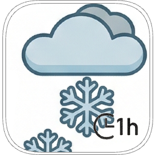 | Shower(s) of snow, or of rain and snow during the past hour |
| 27 | 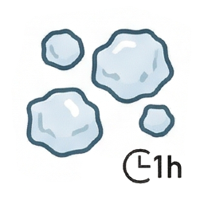 | Shower(s) of hail, or of rain and hail during the past hour |
| 28 | 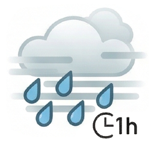 | Fog or ice fog during the past hour |
| 29 | 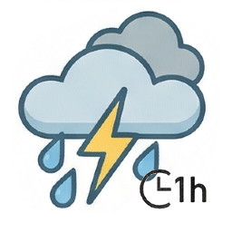 | Thunderstorm (with or without precipitation) during the past hour |
| 30 | 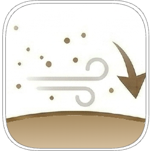 | Slight or moderate duststorm or sandstorm - has decreased |
| 31 | 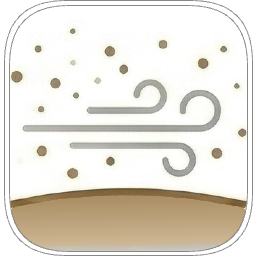 | Slight or moderate duststorm or sandstorm - no appreciable change |
| 32 |  | Slight or moderate duststorm or sandstorm - has begun or increased |
| 33 |  | Severe duststorm or sandstorm - has decreased |
| 34 | 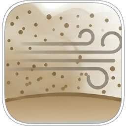 | Severe duststorm or sandstorm - no appreciable change |
| 35 |  | Severe duststorm or sandstorm - has begun or increased |
| 36 | 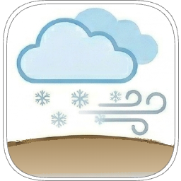 | Slight or moderate drifting snow - generally low (below eye level) |
| 37 | 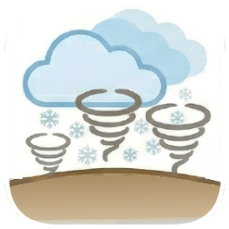 | Heavy drifting snow - generally low (below eye level) |
| 38 | 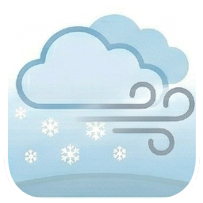 | Slight or moderate blowing snow - generally high (above eye level) |
| 39 | 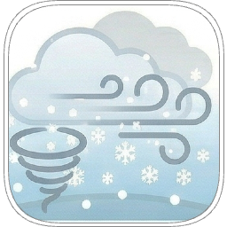 | Heavy blowing snow - generally high (above eye level) |
| 40 | 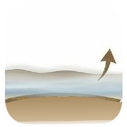 | Fog or ice fog at a distance |
| 41 |  | Fog or ice fog in patches |
| 42 | 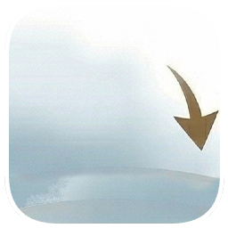 | Fog or ice fog, sky visible, has become thinner |
| 43 | 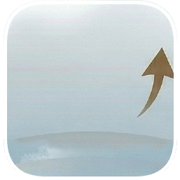 | Fog or ice fog, sky invisible, has become thinner |
| 44 | 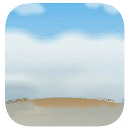 | Fog or ice fog, sky visible, no appreciable change |
| 45 | 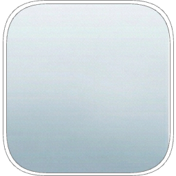 | Fog or ice fog, sky invisible, no appreciable change |
| 46 | 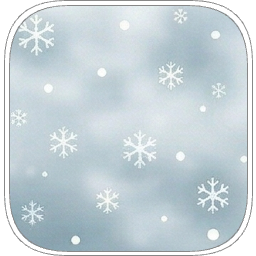 | Fog or ice fog, sky visible, has begun or thickened |
| 47 | 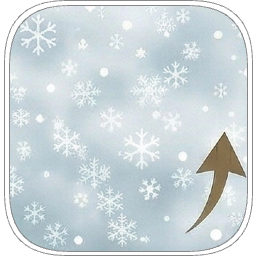 | Fog or ice fog, sky invisible, has begun or thickened |
| 48 | 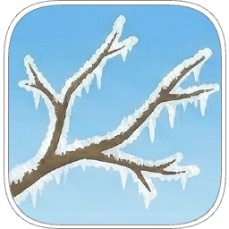 | Fog, depositing rime, sky visible |
| 49 | 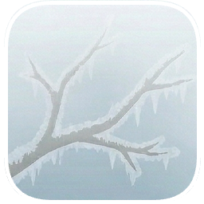 | Fog, depositing rime, sky invisible |
| 50 | 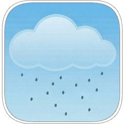 | Drizzle, slight, intermittent |
| 51 | 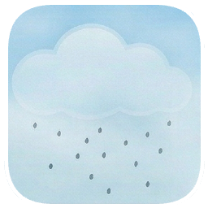 | Drizzle, slight, continuous |
| 52 | 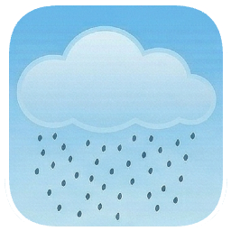 | Drizzle, moderate, intermittent |
| 53 | 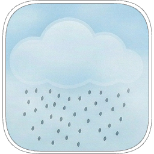 | Drizzle, moderate, continuous |
| 54 | 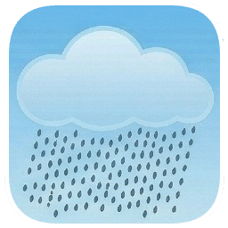 | Drizzle, heavy, intermittent |
| 55 | 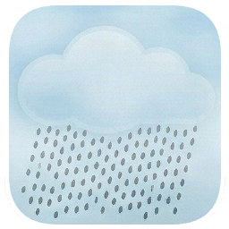 | Drizzle, heavy, continuous |
| 56 | 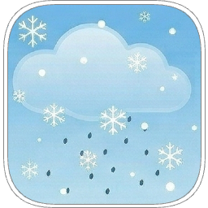 | Freezing drizzle, slight |
| 57 | 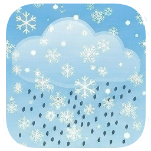 | Freezing drizzle, moderate or heavy |
| 58 |  | Drizzle and rain, slight |
| 59 |  | Drizzle and rain, moderate or heavy |
| 60 |  | Rain, not freezing, intermittent, slight |
| 61 |  | Rain, not freezing, continuous, slight |
| 62 |  | Rain, not freezing, intermittent, moderate |
| 63 |  | Rain, not freezing, continuous, moderate |
| 64 |  | Rain, not freezing, intermittent, heavy |
| 65 |  | Rain, not freezing, continuous, heavy |
| 66 |  | Freezing rain, slight |
| 67 |  | Freezing rain, moderate or heavy |
| 68 |  | Rain or drizzle and snow, slight |
| 69 |  | Rain or drizzle and snow, moderate or heavy |
| 70 |  | Intermittent fall of snowflakes, slight |
| 71 |  | Continuous fall of snowflakes, slight |
| 72 |  | Intermittent fall of snowflakes, moderate |
| 73 |  | Continuous fall of snowflakes, moderate |
| 74 |  | Intermittent fall of snowflakes, heavy |
| 75 |  | Continuous fall of snowflakes, heavy |
| 76 |  | Ice needles (with or without fog) |
| 77 |  | Snow grains (with or without fog) |
| 78 |  | Isolated star-like snow crystals (with or without fog) |
| 79 |  | Ice pellets |
| 80 |  | Rain shower(s), slight |
| 81 |  | Rain shower(s), moderate or heavy |
| 82 |  | Rain shower(s), violent |
| 83 |  | Shower(s) of rain and snow mixed, slight |
| 84 |  | Shower(s) of rain and snow mixed, moderate or heavy |
| 85 |  | Snow shower(s), slight |
| 86 |  | Snow shower(s), moderate or heavy |
| 87 |  | Shower(s) of snow pellets or small hail - slight |
| 88 |  | Shower(s) of snow pellets or small hail - moderate or heavy |
| 89 |  | Shower(s) of hail, no thunder - slight |
| 90 |  | Thunderstorm during the past hour but not at time of observation |
| 91 |  | Slight rain at time of observation; thunderstorm during the past hour |
| 92 |  | Moderate or heavy rain; thunderstorm during the past hour |
| 93 |  | Slight snow/rain and snow mixed/hail; thunderstorm during the past hour |
| 94 |  | Moderate or heavy snow/rain and snow mixed/hail; thunderstorm during the past hour |
| 95 |  | Thunderstorm, slight or moderate, with rain/snow |
| 96 |  | Thunderstorm, slight or moderate, with hail |
| 97 |  | Thunderstorm, heavy, with rain/snow |
| 98 |  | Thunderstorm combined with duststorm or sandstorm |
| 99 |  | Thunderstorm, heavy, with hail |

